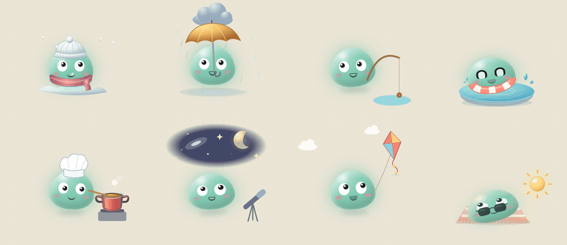

# Bleb



Read and revise a LaTeX manuscript one paragraph at a time in the browser. Bleb, a small jelly mascot, keeps you company while you work.

**[Try it in your browser](https://hoseynaamiri.github.io/bleb/)** on a mock paper. The demo runs entirely in the page: your edits and reviewed marks stay in your browser's local storage, and there is no PDF build.

The tool shows each body paragraph typeset, lets you edit it in place, and writes the change straight back to the `.tex` file. It starts at the abstract or the first section heading, and skips figures, tables, equations, headings and comments.

## Run

```bash
python3 review.py path/to/manuscript.tex
```

The page opens at `http://127.0.0.1:8765`. With no argument, the tool looks for `manuscript.tex` in the current folder.

Python 3 with the standard library is enough. Nothing is installed and nothing leaves your machine, apart from KaTeX, which the page loads from a CDN to typeset math, and any chat model you point it at.

## Use

| Action | Result |
| --- | --- |
| Click | Puts a reading caret in the text. Type to edit the typeset text. |
| Double-click | Switches the paragraph to raw LaTeX, for math, citations and commands. |
| `Ctrl+S` | Saves and rebuilds the PDF. |
| `Ctrl+Enter` | Saves, marks the paragraph reviewed and moves to the next one. |
| `Alt+←` / `Alt+→` | Moves between paragraphs without marking. |
| **Edits** switch | Shows what you changed in each paragraph as tracked insertions and deletions. |
| **Reviewed** switch | Marks or unmarks the current paragraph. |

A reviewed mark belongs to the exact wording. If the text of a paragraph changes, in this tool or in your editor, that paragraph is unreviewed again.

## Files it writes

The tool edits your `.tex` file and keeps two progress files next to it:

- `<name>.reviewed.json`: which paragraphs you marked reviewed.
- `<name>.edits.json`: the original text of each paragraph you edited, for the tracked-changes view.

Both are safe to delete, and you may want them in your `.gitignore`.

## Optional parts

**PDF rebuild.** On save, the tool runs `./build.sh` from the manuscript's folder if that file exists, and `latexmk -pdf` otherwise.

**PDF viewer sync.** After a rebuild, the tool asks the LaTeX Workshop viewer to jump to the caret. This needs `synctex` and LaTeX Workshop running in the editor named by `EDITOR` in `review.py` (default `cursor`).

**Chat.** The side panel sends the paragraph and the manuscript text to an OpenAI-compatible model. The default is LM Studio at `http://127.0.0.1:1234/v1`. The gear in the chat panel sets the base URL, model, API key and context size for your browser.

The port, the editor name and the chat defaults are constants at the top of `review.py`.

## The mascot

Bleb lives in [`bleb/`](bleb/) and can be embedded in other pages. See [`bleb/README.md`](bleb/README.md), or open `/bleb/demo.html` on the running server to try every activity.

### Activities

Bleb picks these on its own while you work. Each one is also a button in the playground and a name you can pass to `bleb.play()`.

| Group | Activities |
| --- | --- |
| Sports | `soccer`, `tennis`, `baseball`, `basketball`, `swimming`, `biking`, `kite`, `fishing` |
| Weather and seasons | `summer`, `rainy`, `snowy`, `autumn`, `sunbathing`, `stargazing` |
| At home | `eating`, `cooking`, `popcorn`, `tv`, `phone`, `newspaper`, `read`, `nap` |
| Science and games | `newton`, `blackHole`, `portal`, `retro`, `digitized`, `pacman`, `detective` |
| Mischief | `hide`, `ghost`, `follow`, `attention`, `peek` |
| Small moves | `hop`, `flip`, `roll`, `twirl`, `stretch`, `dancing`, `hum`, `bubble`, `think`, `lookAround` |
| Walks | `stroll`, `backOff`, `inAndOut`, `faraway` |

`read` tiptoes to your current paragraph and reads the first few words aloud. `follow` chases the pointer, and `attention` comes looking for you when you have been away.

### Routines

An activity usually starts a short routine, and Bleb plays the rest of it over the next few minutes:

- `soccer` → `stretch` → `sunbathing` → `nap`
- `tennis` → `stretch` → `fishing`
- `baseball` → `stretch` → `nap`
- `basketball` → `sunbathing` → `hum`
- `swimming` → `sunbathing` → `nap`
- `summer` → `swimming` → `nap`
- `biking` → `kite` → `sunbathing`
- `dancing` → `stretch` → `popcorn`
- `roll` → `flip` → `stretch` → `sunbathing`
- `hop` → `flip` → `hum`
- `cooking` → `popcorn` → `tv`
- `eating` → `hum` → `nap`
- `phone` → `read` → `think` → `tv`
- `hum` → `phone` → `nap`
- `newspaper` → `think` → `nap`
- `stroll` → `read` → `think` → `fishing`
- `lookAround` → `bubble` → `hum`
- `rainy` → `think` → `sunbathing`
- `snowy` → `hum` → `nap`
- `autumn` → `stroll` → `newspaper`
- `stargazing` → `think` → `nap`
- `detective` → `lookAround` → `newspaper` → `think`
- `newton` → `think` → `blackHole` → `portal`
- `retro` → `digitized` → `pacman` → `nap`
- `hide` → `ghost` → `stargazing` → `nap`
- `follow` → `think` → `nap`

A tired or hurt Bleb skips the routines and sticks to quiet activities such as `nap`, `fishing`, `tv` and `read`.

Between routines Bleb also wanders to favorite spots, moves between near, middle and far depths, gets cross when poked too often, and celebrates as you mark paragraphs reviewed.
